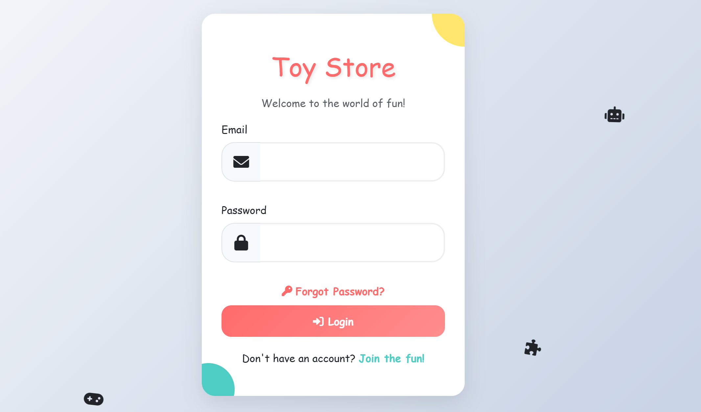
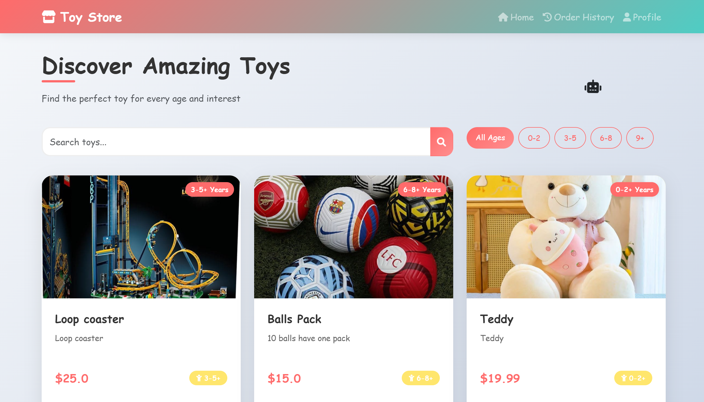
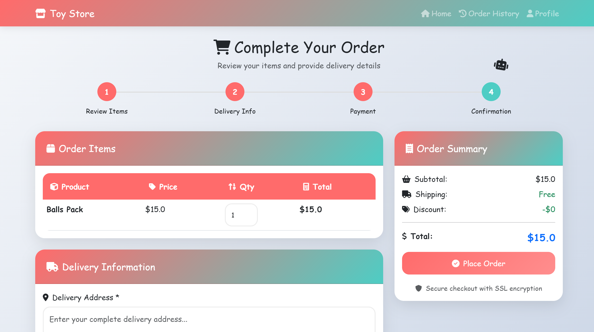

# 🧸 Online Toy Store 🎁

An interactive and fully functional **Toy Store Web Application** developed using Java web technologies. This project is part of my showcases and skills in backend and frontend development, file handling, and data structures.

---

## 🚀 Features

- 🛍️ View, search, and sort toys (Selection Sort used)
- ✍️ Add, update, and delete toy listings (CRUD operations)
- 🔍 Dynamic toy filtering with AJAX
- 🧠 Sorting with Selection Sort algorithm
- 📂 File handling for persistent storage (no database only using text files)
- ✅ Admin & User Interfaces
- 🌐 Built with Servlets and JSP (Java EE - `javax.servlet`)
- 🎨 Responsive UI with Bootstrap, AJAX, and Font Awesome
- 🛠️ Built using Maven and deployed on Apache Tomcat

---

## 🧠 Technologies Used

### 💻 Backend
- Java
- Java Servlets (`javax.servlet`)
- Maven
- Apache Tomcat (Server)
- File I/O (No SQL database only text files)
- Object-Oriented Programming (OOP)
- Data Structures: `LinkedList`, `ArrayList`, `Arrays`
- Sorting: `Selection Sort`
- Using OOP Concepts: Encapsulation, Inheritance, Polymorphism

### 🌐 Frontend
- JSP (JavaServer Pages)
- HTML5
- CSS3
- JavaScript (Vanilla JS + AJAX)
- Bootstrap
- Font Awesome

---
## 🖼️ Screenshots

### 📦 Login Page

### 🏠 Homepage

### ✍️ Order Placement Page

---

## 🔗 Links

- 👨‍💻 Author: [Vinod Madhuranga](https://github.com/Vinod-Madhuranga)
- 📦 Repo: [github.com/Vinod-Madhuranga/Toy-Store](https://github.com/Vinod-Madhuranga/Toy-Store)

